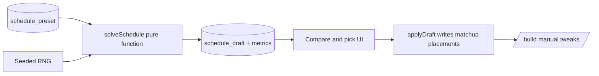

# Schedule Lab: Configurator, Candidates, and Optimizer Core

Three shippable phases, each on its own feature branch/PR. Phases 1 and 2 make the existing algorithm tunable and comparable; phase 3 upgrades the search itself.

## Phase 1 — Weight presets + configurator UI

Make the scoring weights data instead of code, with named, reusable presets.

**Schema** ([src/lib/db/schema/schedule.schema.ts](src/lib/db/schema/schedule.schema.ts))

- New table `schedule_preset`: `id`, `seasonId`, `name`, `weightsJson` (text), `createdAt`. Named presets satisfy "store all the different configurations so we can re-run versions".
- Add `activePresetId` (nullable) to `schedule_config` so regenerate-from-builder uses the chosen preset.
- Migration via `pnpm db generate` / `pnpm db push`.

**Algorithm refactor** ([src/lib/db/queries/schedule-algorithm.ts](src/lib/db/queries/schedule-algorithm.ts))

- Introduce a `SchedulingWeights` type + Zod validator (new `src/validators/scheduling.validators.ts`). Current `SCHEDULING_WEIGHTS` becomes `DEFAULT_SCHEDULING_WEIGHTS`.
- Thread a `weights` param through `getPlacementPreferenceBreakdown`, `getScheduleQualityScore`, `evaluatePlacementSwap`, and the improvement passes in [src/lib/db/queries/schedule.ts](src/lib/db/queries/schedule.ts). Also include tunables beyond weights: `maxGamesPerEvent` default/far-away caps and the femenil-early curve exponent.
- `autoScheduleMatchups(db, seasonId, eventIds, gamesPerEvening, weights?)` defaults to the stored active preset, falling back to defaults.

**API** (extend [src/trpc/router/scheduleConfig.trpc.ts](src/trpc/router/scheduleConfig.trpc.ts))

- `listPresets`, `savePreset`, `deletePreset`, `setActivePreset` (all `protectedProcedure`).
- `generateSchedule` / `regenerateSchedule` in [src/trpc/router/matchup.trpc.ts](src/trpc/router/matchup.trpc.ts) accept an optional `presetId` or inline weights.

**UI** ([src/routes/(authenticated)/seasons/$seasonId/generate.tsx](src/routes/(authenticated)/seasons/$seasonId/generate.tsx))

- Collapsible "Algorithm tuning" panel: one slider/number input per weight with plain-English labels (e.g. "Push femenil early"), preset select + save-as. English copy (admin surface).

## Phase 2 — Multi-candidate generation + compare/pick

**Pure solver extraction** (new `src/lib/scheduling/solver.ts`)

- Extract the solve loop out of `autoScheduleMatchups` into a pure function: `solveSchedule({ matchups, events, constraints, weights, seed }) → { placements, metrics }`. No DB access — all inputs loaded up front, which enables running N solves cheaply and unit-testing the solver. `autoScheduleMatchups` becomes a thin load–solve–persist wrapper.
- Reuse `buildSchedulingMetrics` output (quality score, category deviation, femenil net switches) as the candidate scorecard, plus add per-team stats (games per event spread, far-away 2-games-per-night hit rate).

**Schema**

- New table `schedule_draft`: `id`, `seasonId`, `name`, `presetName`, `weightsJson`, `seed`, `placementsJson`, `metricsJson`, `unscheduledCount`, `createdAt`. Drafts never touch `matchup` placements until applied.

**API** (matchup or new `scheduleDraft` router)

- `generateCandidates({ seasonId, count, presetIds?, weights? })`: runs the solver N times (varying seed and/or preset), stores drafts, returns metrics summaries.
- `listDrafts`, `applyDraft` (writes placements onto `matchup` rows, same shape as `saveSchedule`), `deleteDraft`, `clearDrafts`.

**UI**

- Candidates section on the generate page (or a `/seasons/$seasonId/candidates` step before `/build`): metric cards per candidate, expandable mini schedule grid (event × court × slot with category colors), "Apply" navigates to `/build`. Applying a draft is the only mutation of real placements.

## Phase 3 — Optimizer core: seeded annealing + delta scoring

All inside `src/lib/scheduling/solver.ts`; no schema or UI changes beyond exposing an "effort" setting.

- **Seeded RNG** (mulberry32-style) so a draft's `seed` reproduces its schedule exactly.
- **Delta scoring**: restructure the quality score to decompose per event (with the adjacent-event rest term touching event ± 1), so evaluating a move only rescoring affected events instead of the current full O(n²) `getScheduleQualityScore` recompute in `evaluatePlacementSwap`. This removes the need for `MAX_SWAP_EVALUATIONS_PER_PASS`-style truncation.
- **Simulated annealing** replacing the three first-improvement swap passes, with three move types: swap two placements, relocate a placement to an empty slot, and swap a scheduled matchup with one from the unscheduled pool (currently impossible — unscheduled games can never displace scheduled ones). Hard constraints remain a validity filter on every move.
- **Multi-restart**: each candidate = greedy seed placement (existing pass) + annealing run; time-budgeted (~1–3 s per candidate) to stay inside Vercel function limits.
- **Tests** (Vitest, alongside `src/lib/standings/ranking.test.ts`): fixture season; assert hard constraints always hold, same seed → same schedule, and annealed quality score ≤ greedy baseline score.

## Later (not in this plan, cheap to add after Phase 2)

- Log manual moves in the builder after applying a draft (matchup id, from → to) as tuning feedback for which weights to adjust.

## Verification

- `pnpm check` and `pnpm test` per phase; manual run-through of generate → candidates → apply → build on a real season locally.

